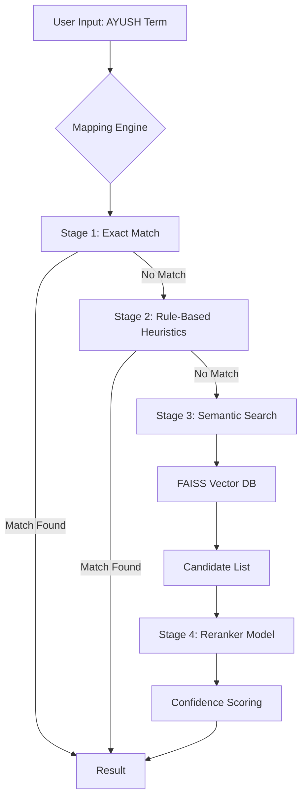

# Agentic AI in AYUSH Clinic Management System

This document explains the "Agentic AI" components integrated into the AYUSH Clinic Management System. These components work together to bridge the gap between traditional Indian medicine (NAMASTE) and modern biomedical classification (ICD-11).

## Overview

The system employs a **multi-stage reasoning pipeline** to suggest accurate ICD-11 codes for AYUSH terms. Unlike simple keyword matching, this approach mimics a human expert's decision-making process:

1.  **Rule Application**: Checking for known, standard mappings.
2.  **Semantic Search**: Understanding the meaning of the term.
3.  **Reranking**: Evaluating candidates based on context and confidence.

## Architecture

## Components

### 1. Mapping Engine (`services/mapping_engine.py`)
The "brain" of the terminology service. It orchestrates the translation process.

*   **Role**: Translator Agent
*   **Logic**:
    *   First, it checks `data/namaste.csv` for an **Exact Match**. This is the most reliable source.
    *   If not found, it applies **Rule-Based Heuristics** (e.g., mapping "Jwara" to "Fever" codes based on domain knowledge).
    *   If still not found, it uses **Vector Embeddings** to find semantically similar ICD-11 codes.

### 2. FAISS Vector Database (`services/faiss_index.py`)
A high-performance similarity search engine.

*   **Role**: Semantic Memory
*   **Function**: Stores vector representations (embeddings) of all ICD-11 codes (titles and definitions).
*   **Usage**: When the engine receives a term like "Shiroshula", it converts it to a vector and finds the closest ICD-11 vectors (e.g., "Headache").

### 3. Reranker Model (`data/reranker.joblib`)
A machine learning model (Logistic Regression/XGBoost) trained to refine search results.

*   **Role**: Quality Control / Judge
*   **Function**: Takes the top candidates from the vector search and re-scores them based on additional features (lexical overlap, rule matches, etc.).
*   **Why?**: Vector search sometimes returns "semantically close" but "medically wrong" results. The reranker filters these out.

### 4. Orchestrator (`services/orchestrator.py`)
A background agent that manages long-running tasks.

*   **Role**: Task Manager
*   **Function**: Handles asynchronous operations like bulk mapping updates, index rebuilding, or syncing data (if enabled).

## How It Works in Practice

**Example: "Amlapitta"**

1.  **User** enters "Amlapitta".
2.  **Mapping Engine** checks CSV. If "Amlapitta" is explicitly mapped to "K21.0" (Gastro-oesophageal reflux disease), it returns that immediately (Confidence: 1.0).
3.  **Fallback**: If not in CSV, it searches FAISS.
    *   FAISS finds "Acid reflux", "Heartburn", "Dyspepsia".
4.  **Reranker** analyzes these candidates.
    *   It sees "Acid reflux" has high lexical overlap with the definition of Amlapitta.
    *   It assigns a high probability.
5.  **Result**: System suggests "K21.0 - Gastro-oesophageal reflux disease" with high confidence.

## Future Agentic Capabilities

*   **Clinical Reasoning Agent**: To analyze patient symptoms and suggest diagnoses, not just map terms.
*   **Compliance Agent**: To automatically audit records for insurance validity.
